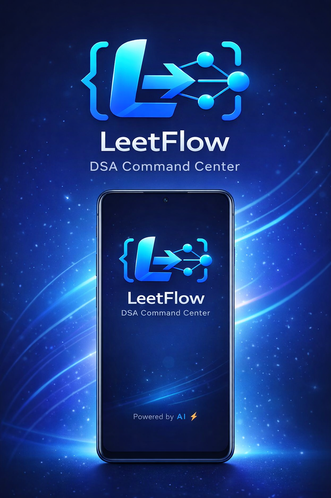
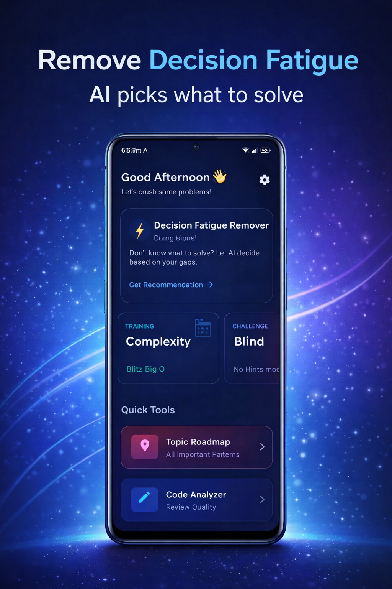
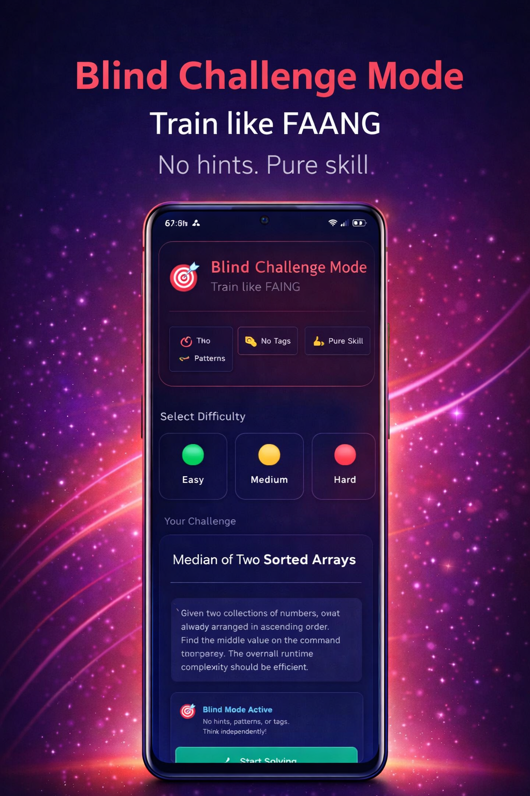
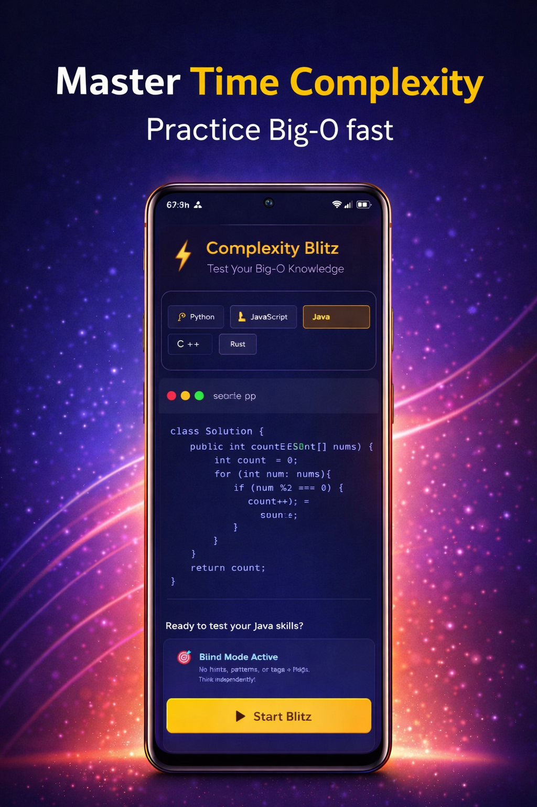
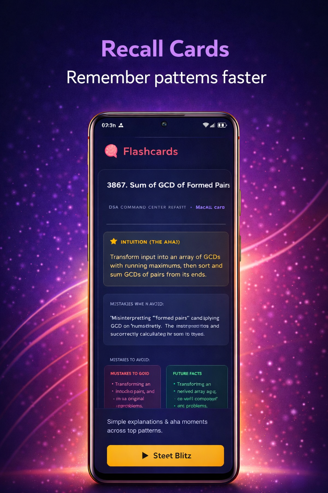
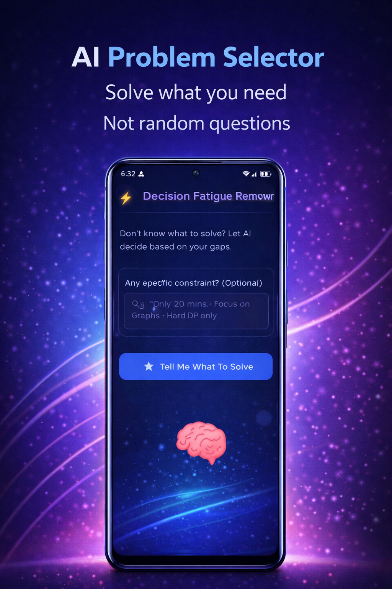

# 🚀 LeetFlow — AI Powered DSA Command Center

  
  
  
  
  
  

LeetFlow is an AI-powered Android application designed to help developers prepare for coding interviews efficiently by removing decision fatigue and generating structured learning paths.

Built using **Kotlin, Jetpack Compose, MVVM, and Clean Architecture**.

---

## 📥 Download APK

  

---

## ✨ Features

* 🎯 Smart Problem Selector
* 🔍 AI Code Analyzer
* 🧠 Flashcards / Recall Notes
* 🗺️ Roadmap Planner
* ⚡ Complexity Blitz
* 🎲 Blind Mode

---

## 🛠 Tech Stack

* Kotlin
* Jetpack Compose
* MVVM
* Clean Architecture
* Room Database
* Navigation Compose
* EncryptedSharedPreferences
* Gemini API

---

## 📸 Screenshots

  
  
  

  
  
  

---

## 🧱 Architecture

Clean Architecture + MVVM

UI → ViewModel → UseCase → Repository → DataSource

✔ Scalable
✔ Testable
✔ Production Ready
✔ Modular

---

## 🎯 Purpose

Most developers struggle with DSA because they don't know:

* what to solve
* what pattern to learn
* whether their solution is optimal

LeetFlow solves this using AI-powered guidance.

---

## 🚀 Future Improvements

* LeetCode sync
* Progress analytics
* Cloud backup
* Leaderboard
* Study groups
* Interview mode

---

## 👨‍💻 Author

Aditya Tiwari
Android Developer

GitHub
https://github.com/theadityatiwari
